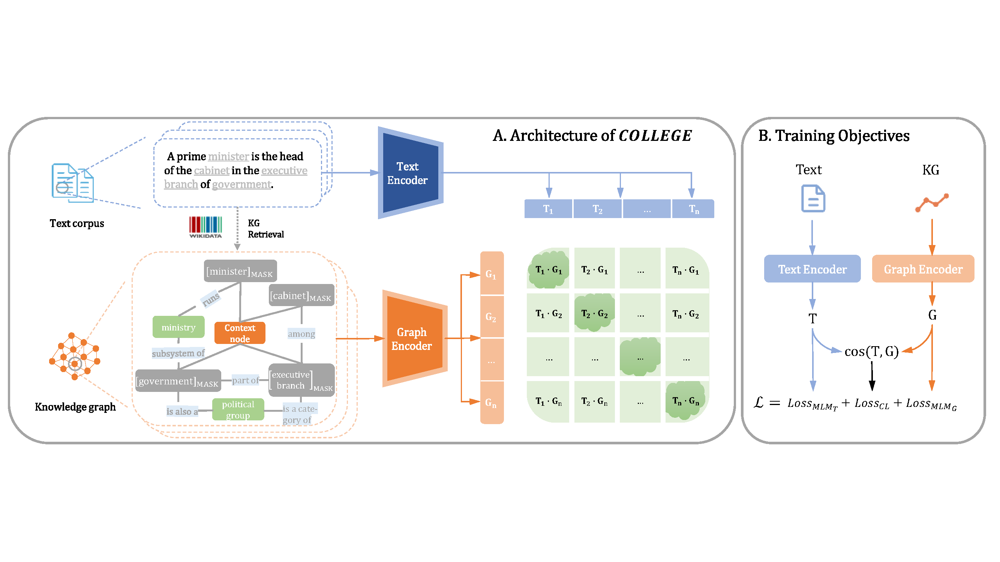

# COLLEGE
code & data for paper "Contrastive Language-Knowledge Graph Pre-training"
### Overview
COLLEGE (**Co**ntrastive **L**anguage-Know**le**dge **G**raph Pr**e**-training) leverages contrastive learning to incorporate factual knowledge into PLMs. This approach maintains the knowledge in its original graph structure to provide the most available information and circumvents the issue of heterogeneous embedding fusion. Experimental results demonstrate that our approach achieves more effective results on several knowledge-intensive tasks compared to previous state-of-the-art methods.

<p align="center">
  
</p>

## Requirements

- [PyTorch](http://pytorch.org/) version >= 1.18.0
- Python version >= 3.8
- For training new models, you'll also need an NVIDIA GPU

## Download pretrained models
You can download pretrained COLLEGE models below and put it in the model directory.
| Model | Size | Pretraining Text | Pretraining Knowledge Graph | Download Link |
| ------------- | --------- | ---- | ---- | ---- |
| COLLEGE   | 320M parameters | Wikipedia | Wikidata | [model checkpoint](https://nlp.stanford.edu/projects/myasu/DRAGON/models/general_model.pt) |


## Re-train the COLLEGE
### 1. Download the data

Download the latest wiki dump (XML format):

```bash
cd wikidata
wget -c https://dumps.wikimedia.org/enwiki/latest/enwiki-latest-pages-articles.xml.bz2
```

Download the knowledge graph (Wikidata5M):

```bash
wget -c https://www.dropbox.com/s/6sbhm0rwo4l73jq/wikidata5m_transductive.tar.gz?dl=1
tar -xzvf wikidata5m_transductive.tar.gz
```

Download the Wikidata5M entity & relation aliases:

```bash
wget -c https://www.dropbox.com/s/lnbhc8yuhit4wm5/wikidata5m_alias.tar.gz?dl=1
tar -xzvf wikidata5m_alias.tar.gz
```

### 2. Preprocess the data

Preprocess wiki dump:

```bash
mkdir pretrain_data
# process xml-format wiki dump
python preprocess/WikiExtractor.py enwiki-latest-pages-articles.xml.bz2 -o pretrain_data/output -l --min_text_length 100 --filter_disambig_pages -it abbr,b,big --processes 4
python preprocess/extract.py 4
# generate the (text, graph) pair data
python preprocess/data.py 32
```

### 3. Train COLLEGE


```bash
cd code/
python -m torch.distributed.launch --nproc_per_node n train_2hop.py —gpu_num=n # replace the $n$ as the gpu number
```

## Run the experiments
For the downstream experiments on COLLEGE, please refer to the codes in the [CoLAKE repo](https://github.com/txsun1997/CoLAKE) and download the datasets for the experiments in the paper: [Google Drive](https://drive.google.com/file/d/1UNXICdkB5JbRyS5WTq6QNX4ndpMlNob6/view?usp=sharing).

```bash
python download_gdrive.py 1UNXICdkB5JbRyS5WTq6QNX4ndpMlNob6 ./data.tar.gz
tar -xzvf data.tar.gz
```

### Knowledge Probing (LAMA and LAMA-UHN)

```bash
cd lama
python eval_lama.py
```

### Language Understanding Tasks(GLUE)

For the fine-tuning on GLUE tasks, refer to the [official guide of RoBERTa](examples/roberta/README.glue.md).


## Citation
If you find our work helpful, please cite the following:


## Acknowledgments

- [CoLAKE](https://github.com/txsun1997/CoLAKE)

- [LAMA](https://github.com/facebookresearch/LAMA)

- [ERNIE](https://github.com/thunlp/ERNIE)
